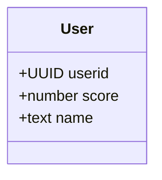
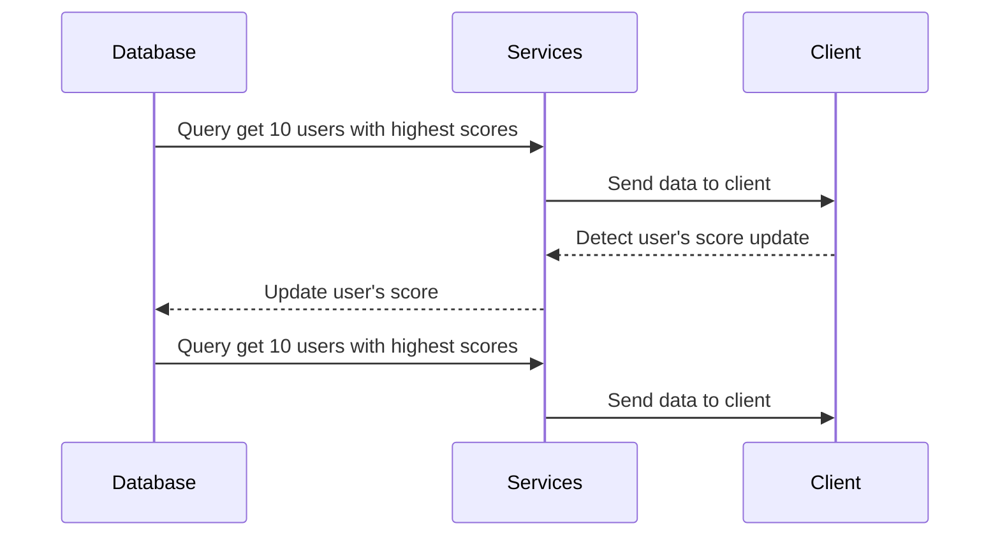
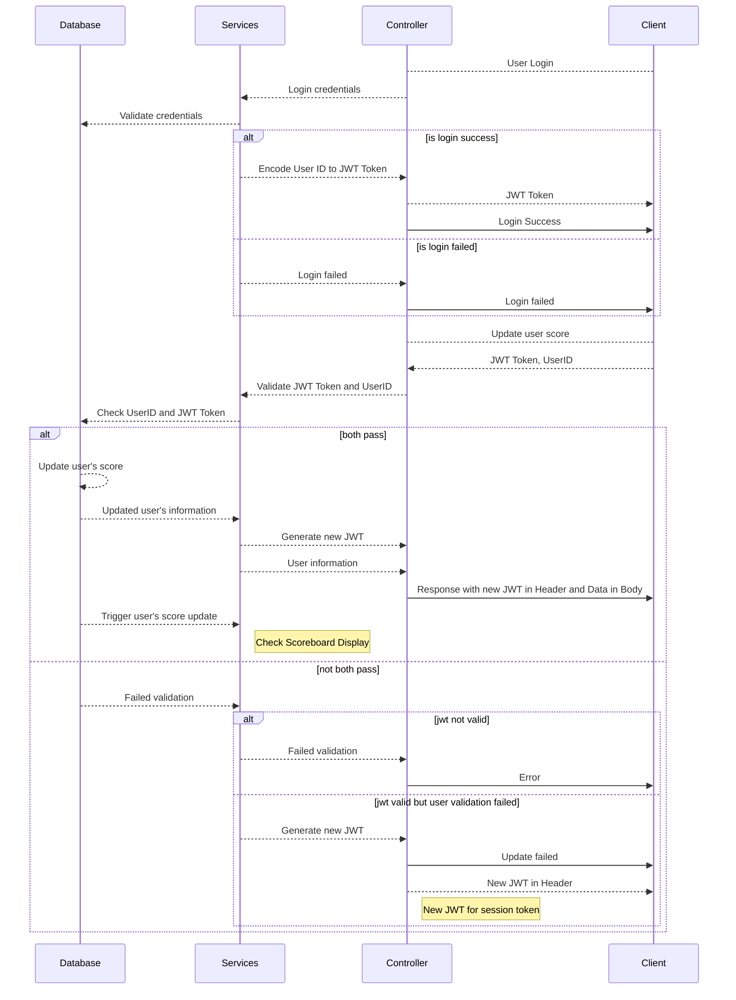

# Scoreboard API Services

## Overview

API to show top 10 user's scores.

## Table of Contents

- [API Feature](#api-feature)
- [Function](#function)
  - [Scoreboard Display](#scoreboard-display)
  - [Authorization](#authorization)

## API Feature

- Show top 10 user's scores
- Live update for the scoreboard
- API to increase user's scores
- Authorization for increasing user's scores

## Function

### Scoreboard Display

### Authorization

